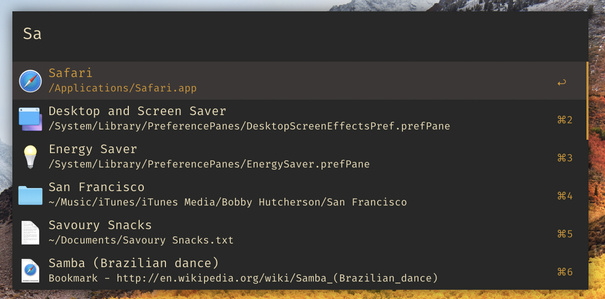

# alfred-gruvbox
>Alfred gruvbox theme

## Install
- Right-click [`Gruvbox.alfredappearance`](https://github.com/kaffeeh/alfred-gruvbox/raw/master/Gruvbox.alfredappearance) and choose `Save Link As…`.
- Double-click the downloaded file.

## License

MIT

